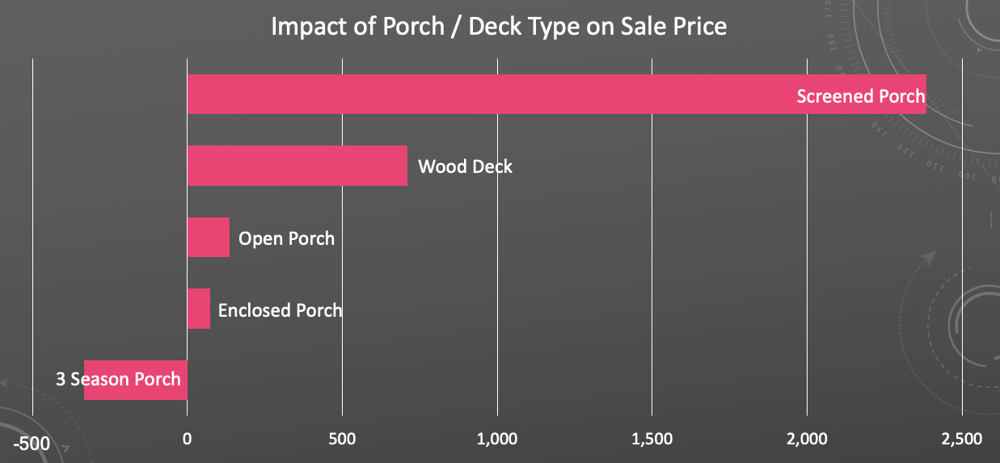
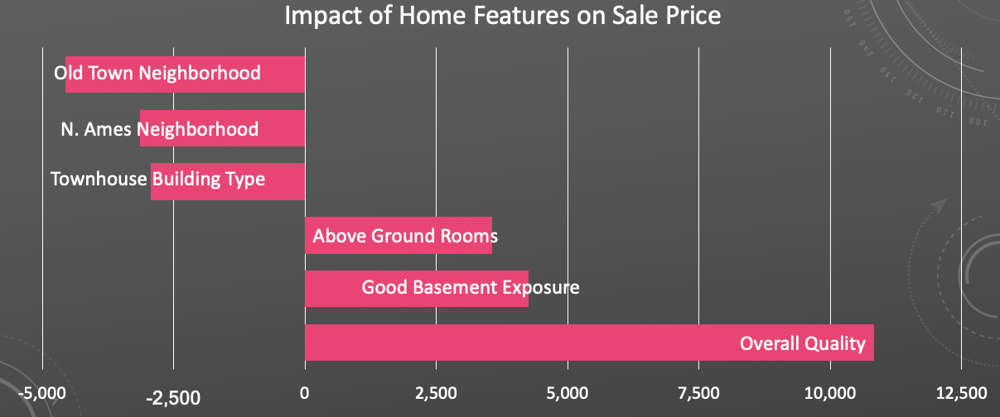
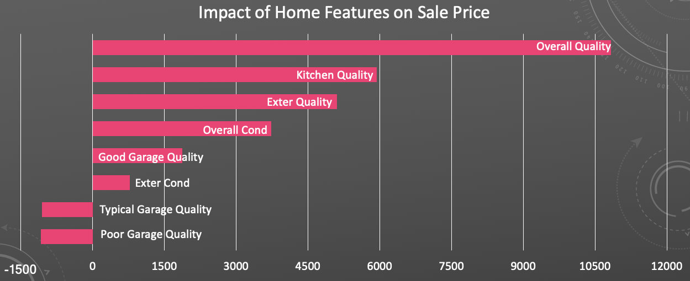

# Ames, IA Housing Data and Kaggle Challenge

Jennifer Brown, General Assembly - DSIR-2-8
March 2021

## Problem Statement

*Home buyers interested in adding outdoor living space may need help deciding what type of space to add, if any. Should a Screened Porch, a Three-Season Porch, an Enclosed Porch, an Open Porch, or a Wood Deck be added and what subsequent impact can be expected on home sale Price. Or, should home buyers consider other features?*

## Background and Executive Summary

This project uses data from the Ames, Iowa found on the Kaggle [*website*](https://www.kaggle.com/prevek18/ames-housing-dataset) with the data dictionary found [*here*](http://jse.amstat.org/v19n3/decock/DataDocumentation.txt). The goal of this project was to build a statistical model designed to predict home sale prices based on home demographics. This project also had special interest in the impact of porches and decks on home sale price. Specifically, where do these home characteristics fall in 'importance' related to other home factors.

### Data

The data for this project was drawn from the Ames, Iowa housing data set which collected detailed information on residential properties sold in Ames, Iowa from 2006 to 2010. The dataset used for modeling included 2051 unique home sales and 81 columns of data for use in analyses.

#### Cleaning

During examination of the data, cleaning and restructuring was necessary for analyses. In most cases, data was legitimately missing from a certain column. For example, homes with no basement would having missing values for any variables related to basement characteristics. Depending on the type of variable, missing values were imputed with a value of 0 (if ordinal). For other variables, dummy variables were constructed. Cases with missing values before dummy construction were still folded into the creation of a dummy variable and were often labeled including a '_NA' or '_none'.  During actual analyses, these dummies were the excluded class while those with the characteristic were included.

Outliers for 'Sale Price' and 'Ground Living Area' were examined in-depth. After boxplot and histogram examinations of these variables the decision was made to remove homes sold for at or more then $500,000 and homes greater than 5000 square feet. The removal of such cases reduced the data set to 2036 cases (down from 2051).

As briefly mentioned above, categorical variables were dummified to 0 / 1 where 1 indicated 'yes' or the existence of the category in question. Several interaction terms were also constructed for further analyses.

#### Exploratory Data Analyses

Prior to model building, examination of relationships between variables was undertaken. This was done to inform understandings of the relationships between the variables and home Sale Price. Additionally, it was done to look for relationships between independent or predictor variables in an effort to reduce multi-collinearity as much as possible.

#### Analyses

Several methods were employed to find a suitable model to answer the question of what impact porches and decks have on home sale price. Most importantly, however, the analyses yielded findings as to other more impactful home characteristics with respect to home sale price. As a start, a basic multi-Linear Regression was used, followed by an MLR model standardizing the data. K Nearest Neighbors was also examined as an option. Both Ridge and Lasso models were examined to inform the inclusion and exclusion of predictors. And lastly, a model using 'Polynomial Features' was examined and put through Ridge and Lasso models to inform the inclusion or exclusion of predictor interactions in a final model.  

After several cycles of model-building, running, and results examinations, a Ridge model was selected as the final model for this project. Reasons include on-going concerns with multi-collinearity and desire to reduce model complexity through reducing coefficients.

#### Results

Ridge Regression results indicate that the impact on Sale Price had by Decks and Porches is variable. All else being held constant, presence of a Screened Porch resulted in the greatest increase in home Sale Price by $2385. A Wood Deck added $709 while an Open Porch and an Enclosed Porch added $137 and $73, respectively. A Three-Season Porch was associated with a decreased Sale Price of $333.

After further examination, these home features' impact on home Sale Price paled in comparison to the impact of several others. Specifically, number of above ground rooms and several quality variables show great increases in Sale Price when all else held constant. Additionally, having good basement exposure was associated with an increased home price. Similarly, several neighborhoods saw decreased home Sale Prices when all else is held constant.

Should homeowners or potential home buyers continue to be interested in making improvements to their homes to increase Sale Price, they could focus on a quality or condition feature. Homes with higher Overall Quality, Kitchen Quality, and Exterior Quality saw increases in Sale Price of respective amounts of $10830, $5932, and $5103 when all else is held constant.

## Data Dictionary

A condensed data dictionary including predictors discussed specifically is below. Detailed variable profiles can be found within the code and [*here*](http://jse.amstat.org/v19n3/decock/DataDocumentation.txt).

|Feature|Type|Dataset|Description|
|---|---|---|---|
|SalePrice|int|train_clean.csv|Home Sale Price| 
|Wood_Deck_Yes|int|train_clean.csv|Dummy variable indicating the presence of a wood deck| 
|Open_Porch_Yes|int|train_clean.csv|Dummy variable indicating the presence of an open porch| 
|Enclosed_Porch_Yes|int|train_clean.csv|Dummy variable indicating the presence of a wood deck| 
|3Ssn_Porch_Yes|int|train_clean.csv|Dummy variable indicating the presence of a 3 season porch| 
|Screen_Porch_Yes|int|train_clean.csv|Dummy variable indicating the presence of a screened porch| 

## Conclusions

Neighborhood and home quality variables were found to have great impacts on Sale Price in both the positive and negative directions depending on the neighborhood and level of quality. Additionally, square footage features of both the above ground and basement spaces were important in the positive direction.

Relating specifically to Decks and Porches, in comparison to several other features, these characteristics added or subtracted what may be considered a nominal amount.

## Recommendations

* Homeowners and potential homeowners should recognize the smaller impact of porches and decks on Sale Price.

* If there are re-sale value concerns - consider other characteristics:
    * Neighborhood
    * Total number of above ground rooms
    * Basement exposure
    * Overall home quality
    
* Improve Quality and Condition features to impact Sale Price.
    * If you have the money to invest and want to help your Sale Price, perhaps consider quality and condition features instead of a porch or a deck.

* Prediction ability in other cities may differ. 
    * Warmer climates may value other qualities such as outdoor living space.

# Sources
* https://www.kaggle.com/prevek18/ames-housing-dataset
* http://jse.amstat.org/v19n3/decock/DataDocumentation.txt
* https://www.mygreatlearning.com/blog/what-is-ridge-regression/